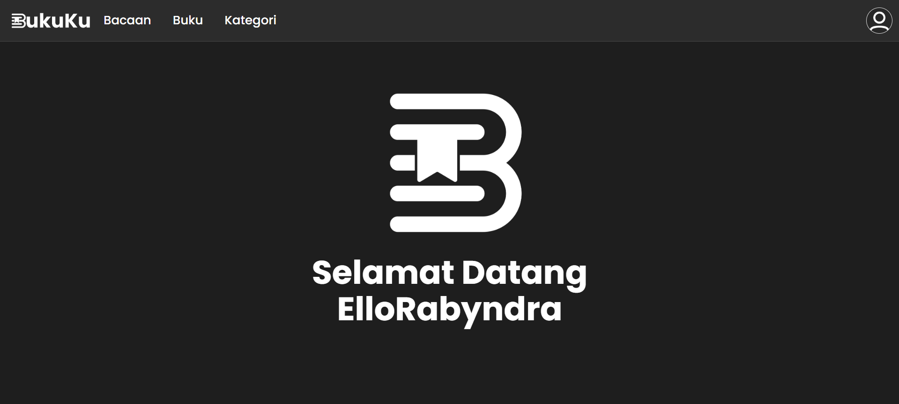
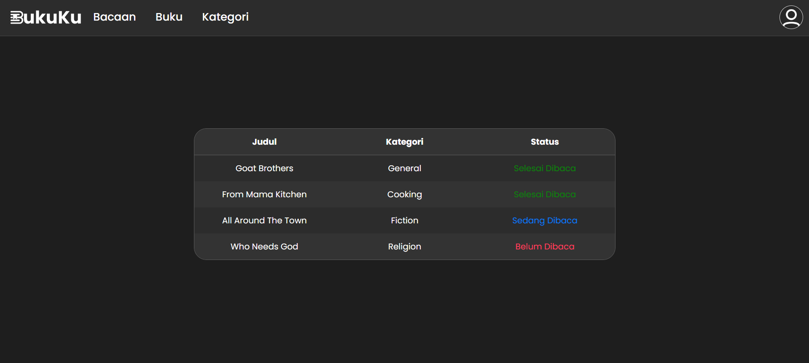
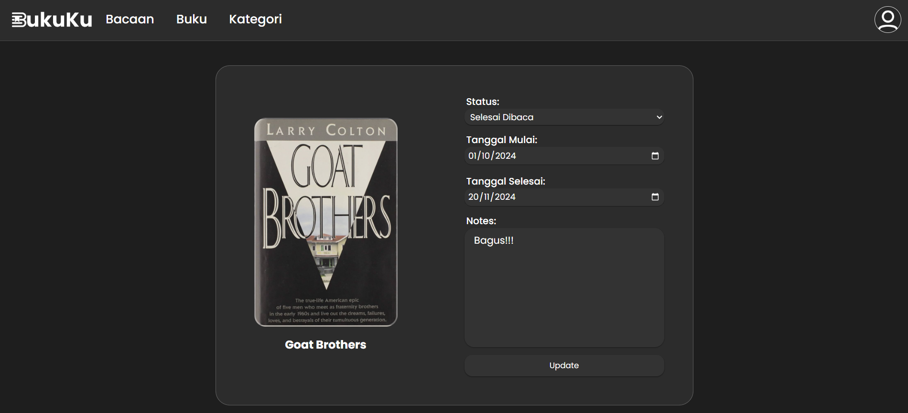
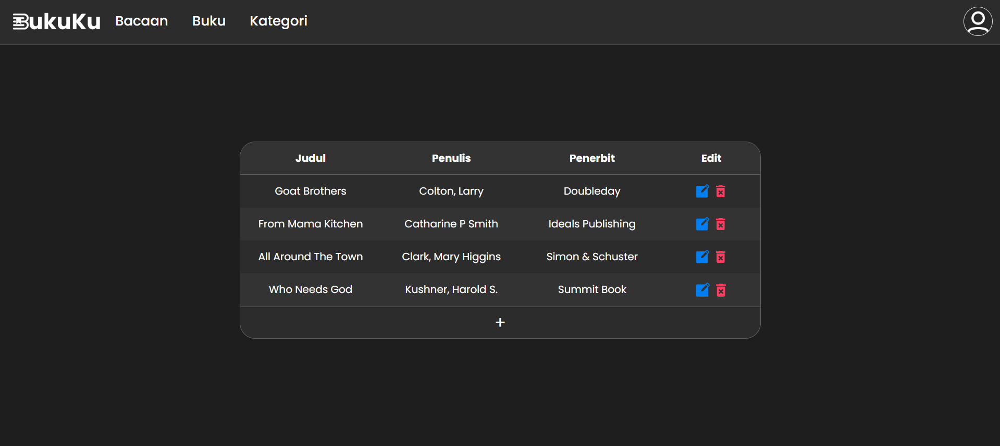
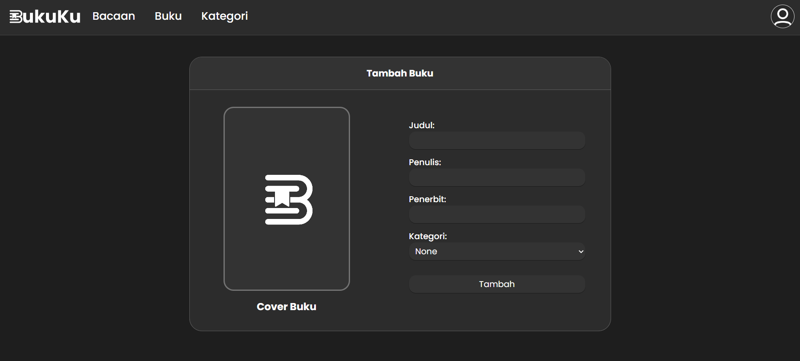
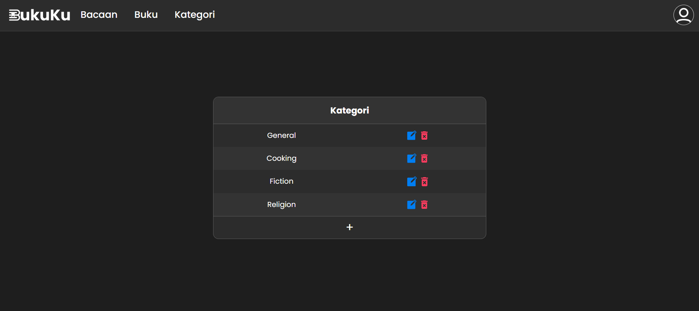
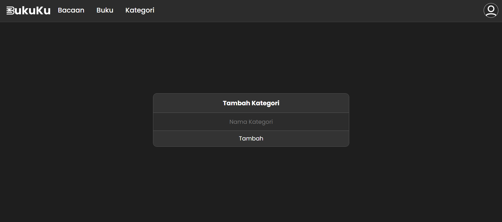
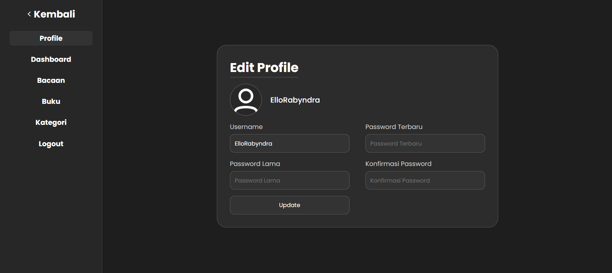
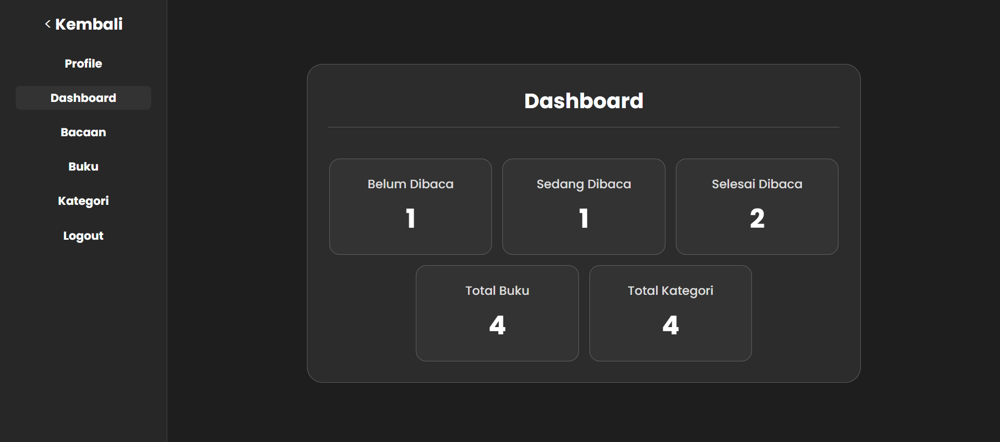

# 📚 Welcome to the BukuKu Website Project!

This website is developed by:

- **M. Rabyndra Janitra Binello**  
- **Abdul Fattah Firdaus**  
- **Fairus Putra Pratama**  

---

## ✨ Features

✅ **Book Management** – Add, edit, delete, and view the list of books.  
✅ **Book Categories** – Users can create and manage book categories.  
✅ **User Authentication** – Register and log in to access website features.  

---

## 🛠️ Technologies Used

🔹 **Frontend** → HTML, Native CSS, EJS  
🔹 **Backend** → Node.js, Express.js  
🔹 **Database** → MySQL  

---

## Installation Guide

### 1️⃣ Database Setup

- Open **XAMPP** and create a new database named **BukuKu**.  
- Import the `BukuKu.sql` file from the `database` folder.  
- If the import is successful, the database will contain 3 tables: **User**, **Book**, and **Categories**.  

### 2️⃣ Running the Project

- Open the project in **Visual Studio Code**.  
- Open the terminal (CMD) and run the following command to install dependencies:  
  ```bash
  npm install

  ```
- Ensure that **MySQL** and **Apache** in **XAMPP** are running.
- Adjust the **MySQL** **username** and **password** in the `.env` file to match your configuration.

  - **Default**: `USERNAME=root`, `PASSWORD=` (empty).
- Run the following command to start the server:
  ```bash
  npm start
  ```
---

## 🌐 Accessing the BukuKu Website

- Open your browser and visit:
  ```
  http://localhost:5000
  ```
- You will be directed to the **login** page. 
- **Register** or use the following credentials to log in:
  - **Username**: `ElloRabyndra`
  - **Password**: `ello`

**Congratulations! You can now use the BukuKu website!**

---

## 📸 Screenshots

Here are some screenshots from the BukuKu website:

### 🏠 Home Page


### 📖 Reading List


### ✅ Manage Reading Status


### 📚 Book List


### ➕ Add Book


### 🗂️ Category List


### ➕ Add Category


### 👤 Profile Page


### 📊 Dashboard

